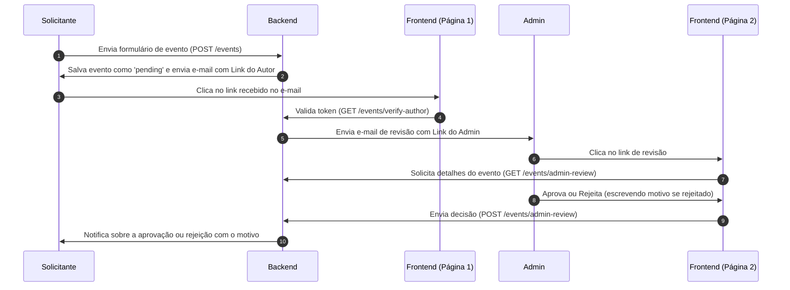

# Documentação de Integração Frontend — Fluxo de Verificação com JWT

Esta documentação descreve as duas novas telas que a equipe de Frontend precisa implementar para suportar o fluxo de verificação e aprovação de eventos internos via e-mail com tokens JWT.

---

## 📋 Visão Geral do Fluxo



---

## 🔑 1. Configuração do `.env` no Frontend

Certifique-se de configurar a URL base da API do Backend no arquivo `.env` do frontend:

```env
NEXT_PUBLIC_API_URL=http://localhost:3000
```

E garanta que a URL de redirecionamento enviada nos e-mails (configurada no `.env` do Backend como `FRONTEND_URL`) aponte corretamente para a rota do seu projeto frontend (ex: `http://localhost:5173` para Vite ou `http://localhost:3000` para Next.js).

---

## 🖥️ Página 1: Confirmação do Autor

* **Rota sugerida no Frontend:** `/verificar-evento` (ou `/events/verify-author` se preferir manter o padrão).
* **Parâmetro de URL:** `token` (Query Parameter).
  * Exemplo de URL de acesso: `http://localhost:3000/verificar-evento?token=eyJhbGciOiJIUzI1NiIsIn...`

### Comportamento da Tela:
1. **Carregamento (Loading):** Ao abrir a tela, extraia o parâmetro `token` da URL e faça uma chamada HTTP `GET` para o endpoint:
   * **Endpoint:** `GET {{backendUrl}}/events/verify-author?token=TOKEN_AQUI`
2. **Sucesso (Status 200):** Se a API retornar sucesso, apresente uma tela amigável informando:
   * **Mensagem:** "Sua solicitação de evento foi confirmada com sucesso e já foi encaminhada para a aprovação do setor de eventos."
   * **Dica visual:** Um ícone verde de check (✅) grande, com visual limpo e moderno.
3. **Erro (Status 400/404):** Se o token estiver expirado ou for inválido, o Backend retornará um erro e terá apagado o evento do banco. Mostre uma mensagem clara informando:
   * **Mensagem:** "Token de verificação inválido ou expirado (tempo limite de 30 minutos excedido). O evento foi cancelado automaticamente. Por favor, acesse o sistema e realize o preenchimento do formulário novamente."
   * **Dica visual:** Um aviso vermelho ou de atenção (⚠️) com um botão de ação rápida para retornar ao formulário de criação de evento.

---

## 🖥️ Página 2: Revisão do Admin (Aprovação/Rejeição)

* **Rota sugerida no Frontend:** `/revisar-evento` (ou `/events/admin-review` se preferir).
* **Parâmetro de URL:** `token` (Query Parameter).
  * Exemplo de URL de acesso: `http://localhost:3000/revisar-evento?token=eyJhbGciOiJIUzI1NiIsIn...`

### Comportamento da Tela:
1. **Carregamento (Loading):** Ao carregar a página, utilize o `token` da query string para buscar todos os dados do evento do backend:
   * **Endpoint:** `GET {{backendUrl}}/events/admin-review?token=TOKEN_AQUI`
   * **Resposta (JSON):** Contém o objeto do evento completo contendo:
     * Código de controle (`controlCode`), título (`eventTitle`), descrição (`eventDescription`), solicitante (`requesterName` e `requesterEmail`), data (`eventDate`), horário (`startTime` e `endTime`), sala/espaço (`selectedRoom`), itens de copa (`copa`), apoios solicitados (`supportTeams`), etc.
2. **Exibição dos Dados:** Apresente todos os dados coletados de forma muito organizada e visualmente rica (separe em seções: Dados do Solicitante, Detalhes do Evento, Logística e Infraestrutura).
3. **Ações do Administrador:** No rodapé ou lateral da tela, exiba duas ações claras:
   * **Botão Aprovar (Verde):** Clicar nele envia imediatamente a aprovação para a API.
   * **Botão Rejeitar (Vermelho):** Clicar nele deve abrir ou expandir um **campo de texto obrigatório** (`textarea`) para que o administrador descreva o motivo da rejeição.
   * **Botão Confirmar Rejeição:** Só fica ativo após o motivo da rejeição ser preenchido (mínimo de 5 caracteres recomendados).

### Chamadas de API para Envio da Decisão:

* **Endpoint:** `POST {{backendUrl}}/events/admin-review`
* **Headers:** `Content-Type: application/json`

#### Payload em caso de APROVAÇÃO:
```json
{
  "token": "TOKEN_DO_URL_AQUI",
  "approved": true
}
```

#### Payload em caso de REJEIÇÃO (com motivo):
```json
{
  "token": "TOKEN_DO_URL_AQUI",
  "approved": false,
  "reason": "O auditório principal já está reservado no mesmo dia e horário para a colação de grau de Direito."
}
```

### Resposta e Feedback Visual:
* Se a requisição for bem-sucedida, apresente uma tela/modal de confirmação informando que o autor foi notificado por e-mail e o status foi atualizado. Redirecione ou limpe a tela.
* Se a decisão já tiver sido tomada anteriormente (por exemplo, se o admin clicar novamente no e-mail após já ter aprovado), o backend retornará uma mensagem informando: `Este evento já foi approved/rejected`. Exiba isso em tela de forma amigável.
